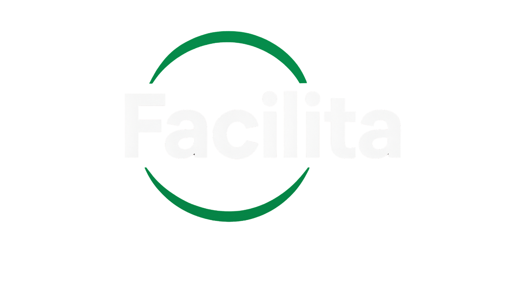

# Facilita 

Nosso sistema Facilita tem como objetivo desenvolver um aplicativo seguro e acessível que conecta pessoas que não podem sair de casa como idosos, pessoas com deficiência ou qualquer usuário temporariamente indisponível a prestadores de serviços de confiança. A plataforma permitirá solicitar tarefas do dia a dia, como compras, remédios ou outros itens essenciais, com acompanhamento em tempo real, comunicação por chat e vídeo, e pagamento digital seguro. O foco do projeto é facilitar a vida dos usuários, promover autonomia, segurança e inclusão social, oferecendo uma solução prática e confiável para necessidades cotidianas.

## Documentação

[Design](https://www.figma.com/design/XOA7dOfNrmPic07LJ22urn/Facilita?node-id=0-1&p=f&t=kAl39srGWcSn8bZ1-0) | [Requisitos funcionais](https://sesisenaispedu-my.sharepoint.com/:w:/g/personal/giovanna_xavier2_portalsesisp_org_br/EbF4CQWQdDVOrDUdiE-1fI4B_AvN4HQ7OJCP_k7cd5TYqw?e=hxQLGA) | [Requisitos não funcionais](https://sesisenaispedu-my.sharepoint.com/:w:/g/personal/giovanna_xavier2_portalsesisp_org_br/EeV7foSSMZJMi-Qgpyt8XTgBQ5yZUFU9QEsLCHeG4DG_9g?e=388UQF) | [Relatórios](https://sesisenaispedu-my.sharepoint.com/:w:/g/personal/kaike_bueno_portalsesisp_org_br/EdzDaaQQFmtHuEnlWeteBQYBMs4uqt640AOIUtDYBcrePQ?e=rkIMWd) |  [Teste de Software](https://sesisenaispedu-my.sharepoint.com/:f:/g/personal/kaike_bueno_portalsesisp_org_br/Es8SRa1mHqRIoJShuJCE4D8B2HXJhlqGYzAmk-5GRbGuZQ?e=9l3h5d) | [TAP](https://www.canva.com/design/DAGxLofq1YQ/Lo4P7uCc52zSTDINP_FJTw/edit?utm_content=DAGxLofq1YQ&utm_campaign=designshare&utm_medium=link2&utm_source=sharebutton)


## Instalação 

Instale o projeto com npm 

```bash
  npm install facilita
  cd facilita
```


## Rodando localmente 

Clone o projeto


```bash
  git clone https://github.com/gioxavier7/servidor-facilita.git
```


## Variáveis de Ambiente 

## Rodando os testes 

## Funcionalidades

- Interface responsiva e acessível  
- Sistema de contratação de serviços com fluxo simples e direto
- Ativação e uso da localização em tempo real
- Busca e listagem de serviços disponíveis na região
- Histórico de serviços prestados ou solicitados 
- Multiplataforma


## Aprendizados 

O projeto Facilita é uma plataforma que conecta pessoas que precisam de serviços com prestadores qualificados de forma prática e organizada. 
Desde o início do desenvolvimento, nós do grupo ja percebemos a importância do planejamento, da organização e do trabalho em equipe, além de muito foco e principlamente a não desistir diante dos desafios. Para superar as dificuldades estamos testamos soluções diferentes, mas tambem muita persistencia. O projeto ainda está em andamento, mas já tem proporcionado aprendizado sobre trabalho em equipe, foco e resolução de problemas, ao mesmo tempo em que estamos cumprindo o objetivo de cada sprint e na construção do projeto final.


## Autores

- [@lahoracio](https://github.com/fritute)
- [@fritute](https://github.com/fritute)
- [@gioxavier7](https://github.com/gioxavier7)
- [@kbueno011](https://github.com/kbueno011)
- [@Joaofpedro1612](https://github.com/Joaofpedro1612)


## Relacionados

Segue alguns repositórios relacionados

- [Mobile](https://github.com/kbueno011/Facilita--Mobile--TCC)
- [FrontEnd](https://github.com/fritute/facilita-front-end)
- [BackEnd](https://github.com/gioxavier7/servidor-facilita)

## Referência 

- React
- JavaScript
- MySql
- Trello